# Minimal Application Checklist
## Database Design
- [ ] ER diagram of the database 

- [ ] Table scripts 

## Project Setup

- [ ] Create a new Java project
- [ ] Set up a MySQL database
- [ ] Add necessary libraries
	- [ ] JDBC, 
	- [ ] MySQL Connector, 
	- [ ] JUnit, 
	- [ ] Dotenv

-   Appointment and Design Module
 	- [ ] List All Designer Profiles    
    - [ ] Designer Profile Details  
     - [ ] Book Now  
     - [ ]  List All Designer's Appointment Requests  
     - [ ] Update Request Status
     - [ ] create new design
     - [ ] list all designs
     - [ ] list all user designs
     - [ ] update design details
     - [ ] update design assets
     - [ ] delete design 

## Module: User 

### Feature: Create User

>User can create a new account.

#### Pre-requisites:
- [ ]  users table
- [ ]  user model
- [ ]   user DAO ( create )
- [ ]  user service ( create )

#### Validations:

 - [ ]   Form Validation
   * user null
   * name ( null, empty, pattern )
   * email ( null, empty, pattern )
   * password ( null, empty, pattern )
   * phone number ( length, >= 600000001 && <= 9999999999 )
     
  - [ ]   Business Validation
         * Email Already exists 

#### Messages:

   * User object can not be null.
   * Name can not be null or empty.
   * Email can not be null or empty.
   * Email does not match the pattern.
   * Password can not be null or empty.
   * Password does not match the pattern.
   * Phone number can not be less than or more than 10 digits.
   * Phone number does not match the pattern.
   * Email already exists  
   
 #### Flow: 
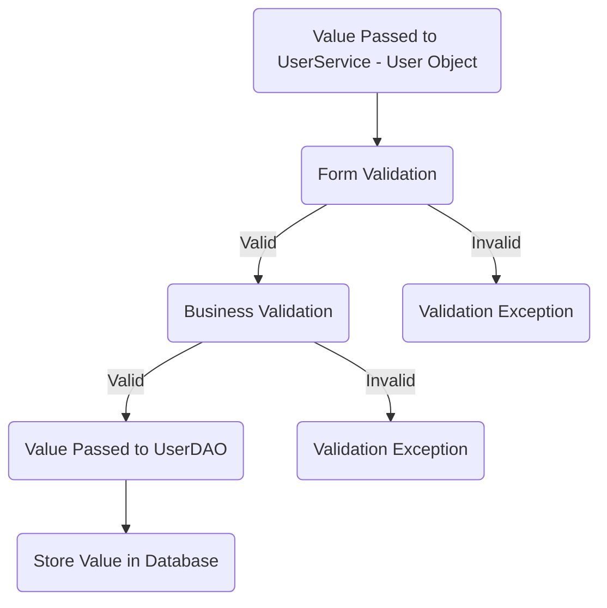
```mermaid
graph TD;
  A(Value Passed to UserService - User Object) --> B(Form Validation) -- Valid --> C(Business Validation)
  B --Invalid --> G(Validation Exception)
  C-- Valid --> D(Value Passed to UserDAO)
  D --> E(Store Value in Database)
  C -- Invalid --> F(Validation Exception)
```

### Feature: User Details

>We can get all the current user details.

#### Pre-requisites:
- [ ]  user interface ( findByEmail)
- [ ]  user DAO ( findAll, findById, findByEmail)
- [ ]  user service ( findAll, findById, findByEmail)

#### Validations:
 - [ ]   Form Validation
  * Id <= 0
  * Email ( null , email , pattern )

                
  - [ ]   Business Validation
  * Check whether the Id exists
  * Check whether the email exists

              
#### Messages:
 * Id can not be less than zero.
 * Email can not be null or empty.
 * Email does not match the pattern.
 * Password can not be null or empty.
 * Password does not match the pattern.
 * Id doesn't exists. 
 * Email doesn't exists. 

           
  #### Flow: 

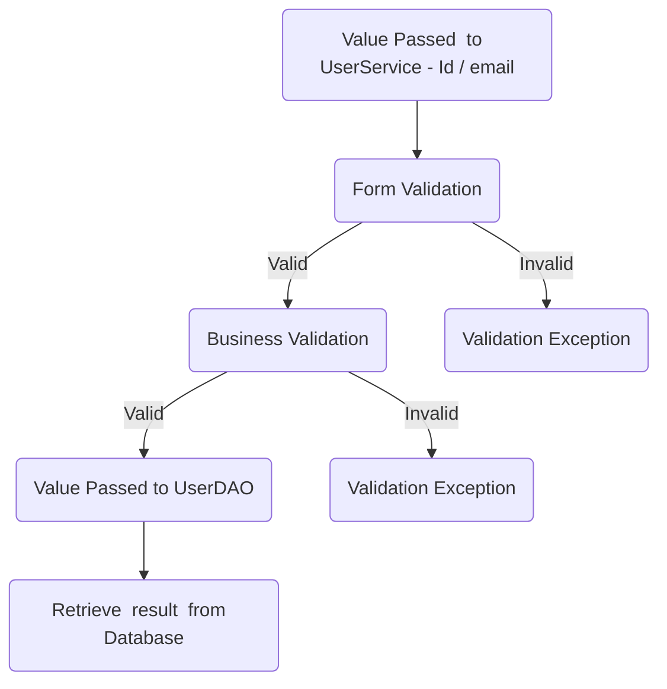
```mermaid
graph TD;
  A(Value Passed  to  UserService - Id / email ) -->B(Form Validation) -- Valid --> C(Business Validation)
  B --Invalid --> H(Validation Exception)
  C -- Valid--> D(Value Passed  to  UserDAO)
  D --> E(Retrieve  result  from  Database)
  C -- Invalid --> F(Validation Exception)
```

### Feature: Update User

>Existing user can update their details.

#### Pre-requisites:
 - [ ]  user dao ( update )

 - [ ]  user service ( update )
 
 #### Validations:
  - [ ]   Form Validation
     * Id <= 0
     * User Object
          *  user null
          * name ( null, empty, pattern )
          * password ( null, empty, pattern )
          * phone number ( length, >= 600000001 && <= 9999999999 )

  - [ ]   Business Validation

       * Check whether the Id exists
       
#### Messages:

* Id can not be less than zero.
* User object can not be null
* Name can not be null or empty.
* Password can not be null or empty.
* Password does not match the pattern.
* Phone number can not be less than or more than 10 digits.
* Phone number does not match the pattern.
* Id doesn't exists
         
 #### Flow: 

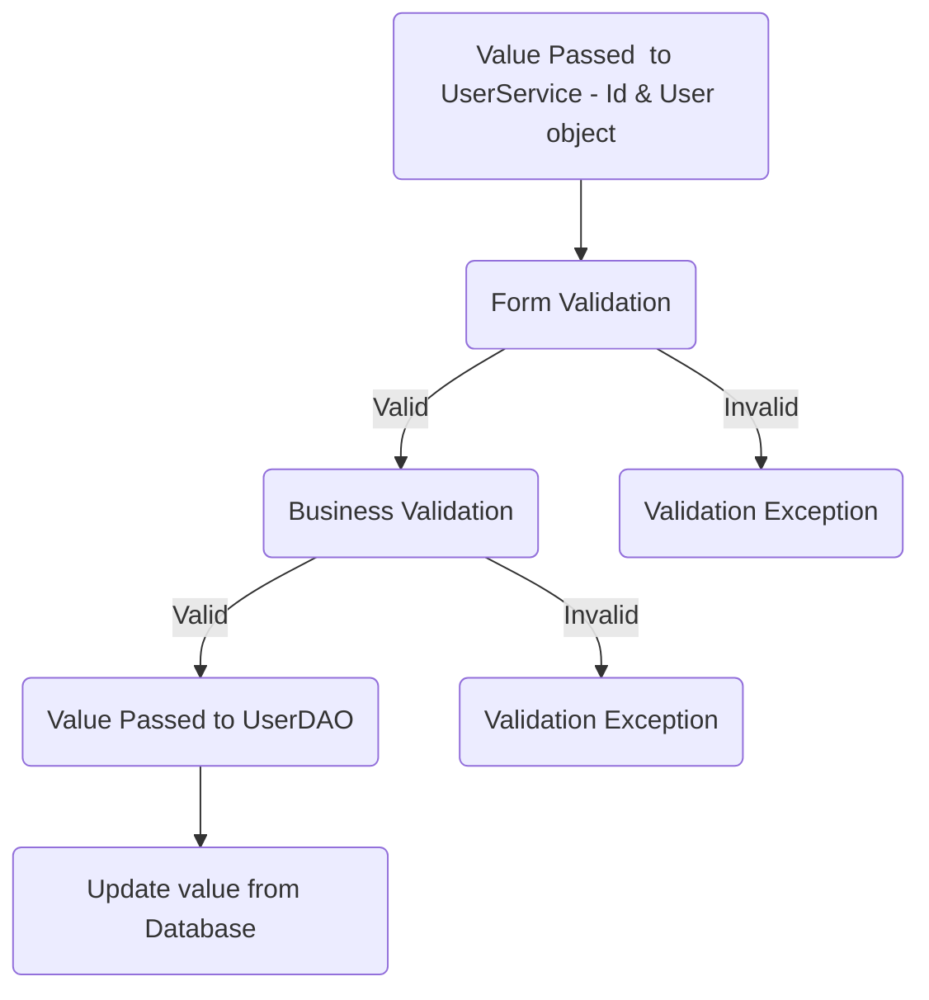
```mermaid
graph TD;
  A(Value Passed  to  UserService - Id & User object) --> B(Form Validation) -- Valid --> C(Business Validation)
  B --Invalid --> H(Validation Exception)
  C -- Valid--> D(Value Passed  to  UserDAO)
  D --> E(Update value from  Database)
  C -- Invalid --> F(Validation Exception)
```

 ### Feature: Delete User
 
 >User can log out from their account.
 
#### Pre-requisites:
 - [ ]  user dao ( delete  )

 - [ ]  user service ( delete )
 
#### Validations:
 - [ ]   Form Validation

     * Id <= 0

 - [ ]   Business Validation

      * Check whether the Id exists

#### Messages:
* Id can not be less than zero
* Id doesn't exists
      
 #### Flow: 

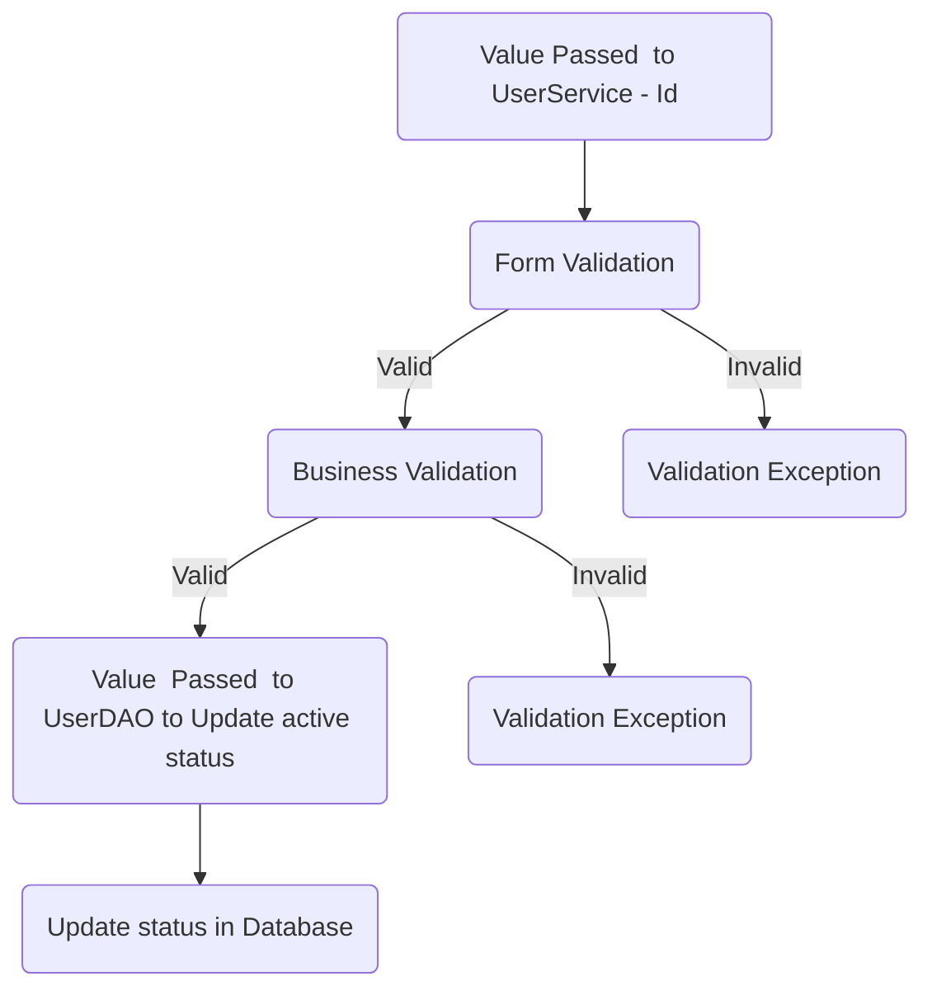
```mermaid
graph TD;
  A(Value Passed  to  UserService - Id) -->B(Form Validation) -- Valid --> C(Business Validation)
  B --Invalid --> G(Validation Exception)
  C -- Valid --> D(Value  Passed  to  UserDAO to Update active status)
  D --> E(Update status in Database)
  C -- Invalid --> F(Validation Exception)
```

## Module: Appointment ( Consumer )  

### Feature: List all designer profiles  

>User can see all the designer profiles.

#### Pre-requisites:

- [ ] user dao ( findAllDesigner )  
- [ ] user service ( findAllDesigner )
      
 #### Flow:  

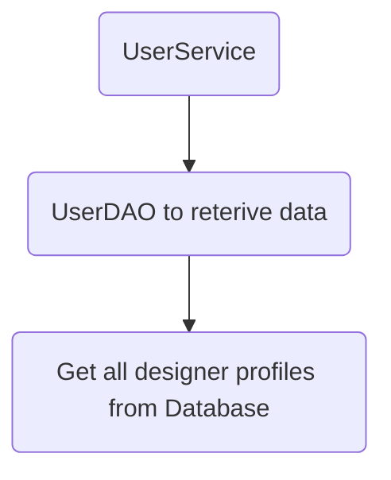
```mermaid  
graph TD;  
A(UserService) --> B(UserDAO to reterive data)  
B --> C(Get all designer profiles from Database)  
```
       
### Feature: Designer profile details  

> User can see the profile details of a particular designer.

#### Pre-requisites:

- [ ] user dao ( findDesignerById )
- [ ]  user service ( findDesignerById  )
      
#### Validations:  
  - [ ]   Form Validation
                 
       * Id <= 0
   
   - [ ]   Business Validation
   
        * Check whether the Id exists
         
#### Messages:
* Id can not be less than zero
* Id doesn't exists     
         
 #### Flow:  

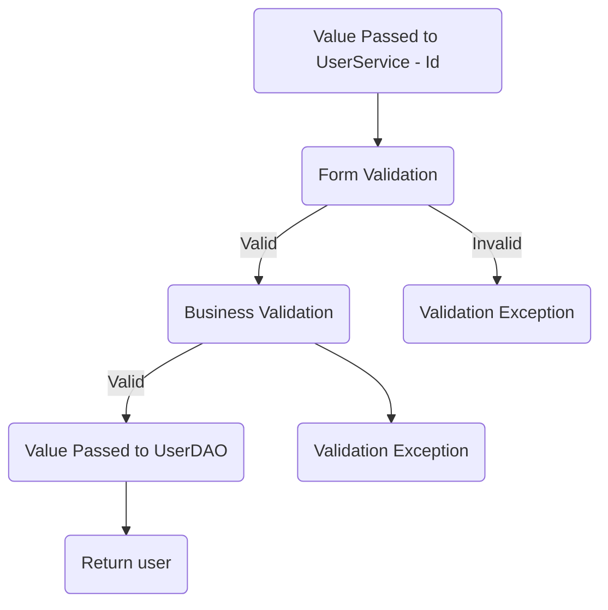
```mermaid  
graph TD;  
A(Value Passed to UserService - Id) --> B(Form Validation) -- Valid --> C(Business Validation)
B --Invalid --> G(Validation Exception)
C -- Valid --> D(Value Passed to UserDAO)  
D --> E(Return user)  
C --> F(Validation Exception)  
```
## Module: Appointment 
### Table

### Feature: Book Now

> User can book appointment with a designer.

#### Pre-requisites:
- [ ]  appointment table
- [ ]  appointment model
- [ ]  appointment dao (create )
- [ ]  appointment service ( create )

#### Validations:

 - [ ]   Form Validation
 
      * appointment object null
      * from_user ( id <= 0 ) (Exists check in user table )
      *  to_user ( id <= 0 ) (Exists check in user table )
      * email ( null, empty, pattern )
      * phone number ( length, >= 600000001 && <= 9999999999 )
       * status (null, empty, waiting or approved or rejected)
       *  Date cannot be null
       * Date range cannot be past days , cannot be in future more than 3 months              and cannot be today 
       *  Time cannot be null 
       * Time range cannot be before 8 am , cannot be after 8 pm
          
                     
  - [ ]   Business Validation
  
       * Check whether the from_user exists in user table
       * Check whether the from_user has any appointment in upcoming days
       * Check whether the to_user exists and is_designer in user table
       * Check whether the to_user has an appointment in the same date and time

#### Messages:
 * Appointment object can not be null
* User id can not be less than zero
* Designer id can not be less than zero
* Email can not be null or empty.
* Email does not match the pattern. 
* Phone number can not be less than or more than 10 digits.
* Phone number does not match the pattern.
* Status can not be null or empty
* Status does not match the pattern.
* Date can not be null
* Due date cannot be before today, equal to today, or more than 90 days from today
* Time can not be null
* Time should be in the range between 8am and 8pm.
* User doesn't exists
* The appointment you have is yet to be completed. Please be patient.
* Designer doesn't exists
* The designer has an appointment scheduled at that specific time. Please reschedule the appointment for a different time slot.

 #### Flow: 

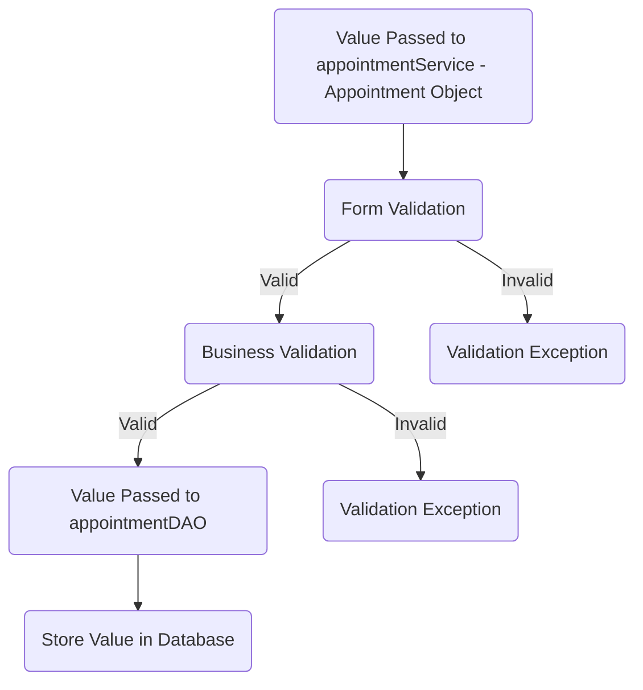
```mermaid
graph TD;
  A(Value Passed to appointmentService - Appointment Object) --> B(Form Validation) -- Valid --> C(Business Validation)
  B --Invalid --> G(Validation Exception)
  C -- Valid --> D(Value Passed to appointmentDAO)
  D --> E(Store Value in Database)
  C -- Invalid --> F(Validation Exception)
```

## Module: Appointment ( Designer )

### Feature: List all Designer Appointment request

>Designer can see the appointment request.

#### Pre-requisites:
- [ ] First, complete book appointment feature 
- [ ]  appointment dao ( findAllAppointment , findAllAppointmentRequest )
- [ ]  appointment service ( findAllAppointment, findAllAppointmentRequest )

#### Validations:
  - [ ]   Form Validation
       * status ( null, empty)
       * status ( waiting list // rejected // approved )
         
#### Messages:
* Status can not be null or empty
* Status does not match the pattern.
                  
 #### Flow: 

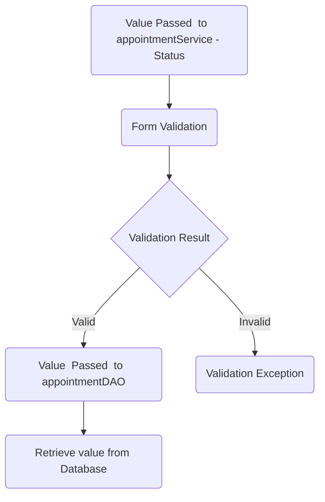
```mermaid
graph TD;
  A(Value Passed  to  appointmentService - Status) --> B(Form Validation)
  B--> C{Validation  Result}
  C -- Valid --> D(Value  Passed  to  appointmentDAO)
  D --> E(Retrieve value from Database)
  C -- Invalid --> F(Validation Exception)
```

### Feature: Update request status

>Designer can update the appointment request.

#### Pre-requisites:

- [ ]  appointment dao ( updateRequestStatus )

- [ ]  appointment service ( updateRequestStatus )
             
#### Validations:
- [ ]  appointment validator
   * id <= 0
    * status ( null, empty)
    * status ( waiting list // rejected // approved )    
           
 
 #### Messages:
* Designer id can not be less than zero
* Status can not be null or empty
* Status does not match the pattern.

         
 #### Flow: 

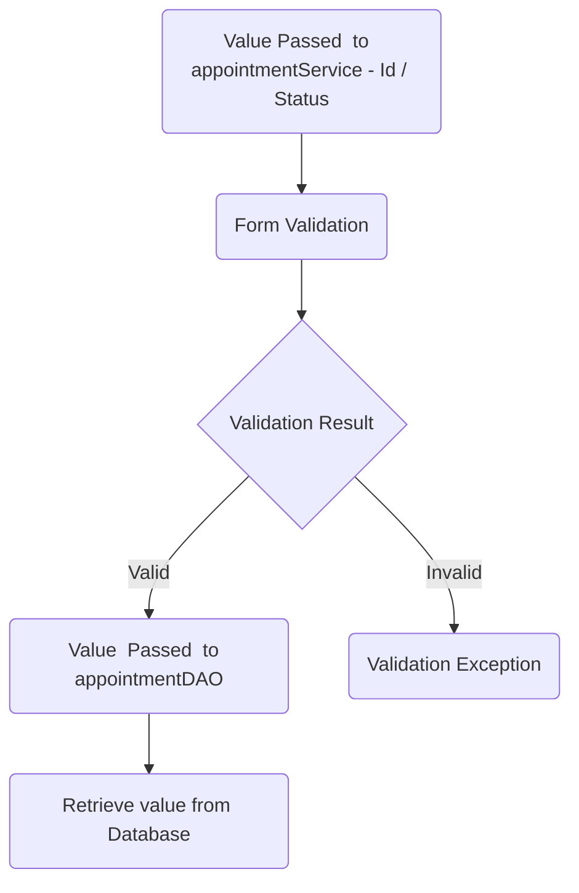
```mermaid
graph TD; 
 A(Value Passed  to  appointmentService - Id / Status) --> B(Form Validation)
  B--> C{Validation  Result}
  C -- Valid --> D(Value  Passed  to  appointmentDAO)
  D --> E(Retrieve value from Database)
  C -- Invalid --> F(Validation Exception)
```

## Module: 	Designs

### Feature: Create New Designs

> Designers can create a new designs or projects.

#### Pre-requisites:
- [ ]  designs table
- [ ]  style table
- [ ]  style service ( create, update )
- [ ]  style dao ( create, update )
- [ ]  designs model
- [ ]   designs DAO ( create )
- [ ]  designs service ( create )

#### Validations:

 - [ ]   Form Validation
   * design null
   * name ( null, empty, pattern )
   * description ( null, empty )
   * location ( null, empty, pattern )
   * style Id ( <= 0 )
   * created by ( <= 0  ) 
   
  - [ ]   Business Validation
         * Check style id exists in style table
         * Check created by exists in users table as designer

#### Messages:

   * Design object can not be null.
   * Name can not be null or empty.
   * Name does not match the pattern.
   * Description can not be null or empty.
   * Location can not be null or empty.
   * Location does not match the pattern.
   * Style Id can't be less than zero.
   * Created By Id can't be less than zero.
   * Style Id doesn't exist.
   * Designers doesn't exist.
   
 #### Flow: 
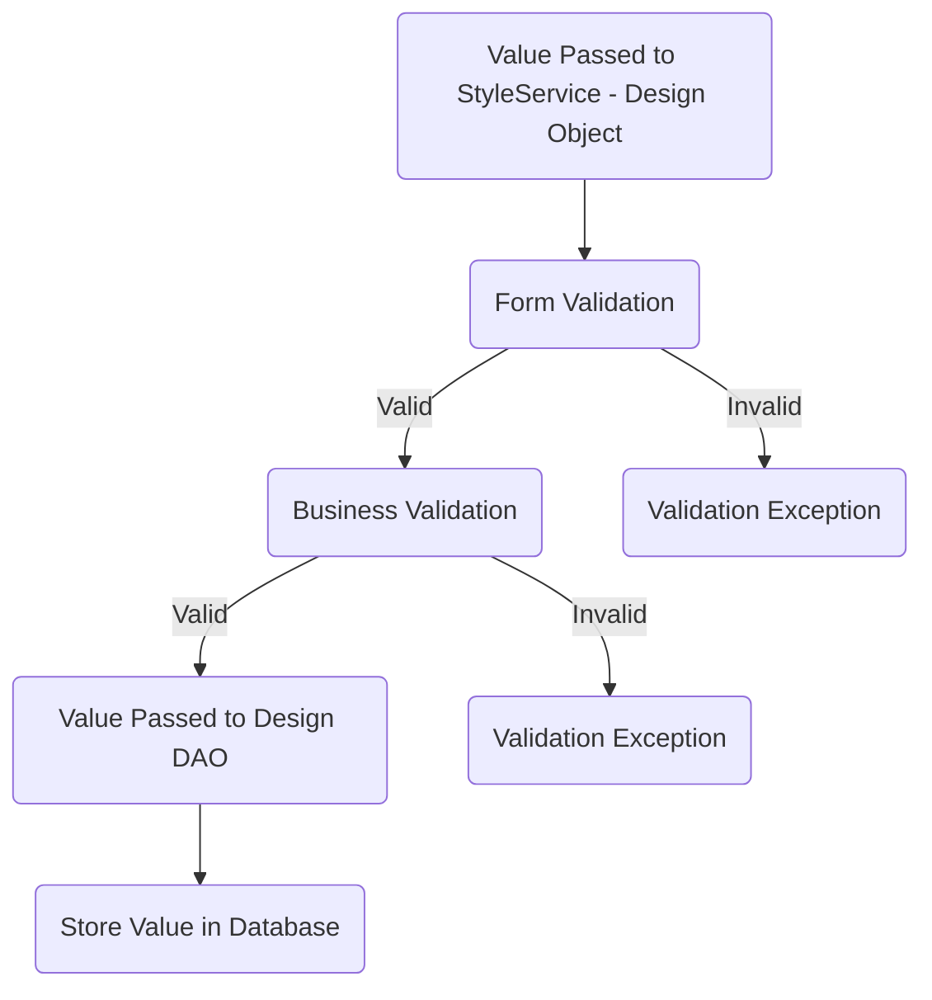
```mermaid
graph TD;
  A(Value Passed to StyleService - Design Object) --> B(Form Validation) -- Valid --> C(Business Validation)
  B --Invalid --> G(Validation Exception)
  C-- Valid --> D(Value Passed to Design DAO)
  D --> E(Store Value in Database)
  C -- Invalid --> F(Validation Exception)
```

### Feature: List all designs
> Designer can delete their design and its assets.

#### Pre-requisites:
- [ ]  asset model
- [ ]  design asset DAO ( findAllDesigns )
- [ ]  design asset service ( findAllDesigns )

 #### Flow: 
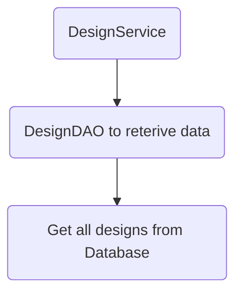
```mermaid
graph TD;
A(DesignService) --> B(DesignDAO to reterive data)  
B --> C(Get all designs from Database)  
```

### Feature: List all user designs
> Designer can delete their design and its assets.

#### Pre-requisites:
- [ ]  asset model
- [ ]  design asset DAO ( findAllDesignsByDesignerId )
- [ ]  design asset service ( findAllDesignsByDesignerId )

#### Validations:

 - [ ]   Form Validation
   * id ( <= 0 )
     
  - [ ]   Business Validation
         * Check id exist in user table 

#### Messages:

   *  id can't be less than zero
   * Id doesn't exist in design asset table.
    * Id doesn't exist in user table.
   
 #### Flow: 
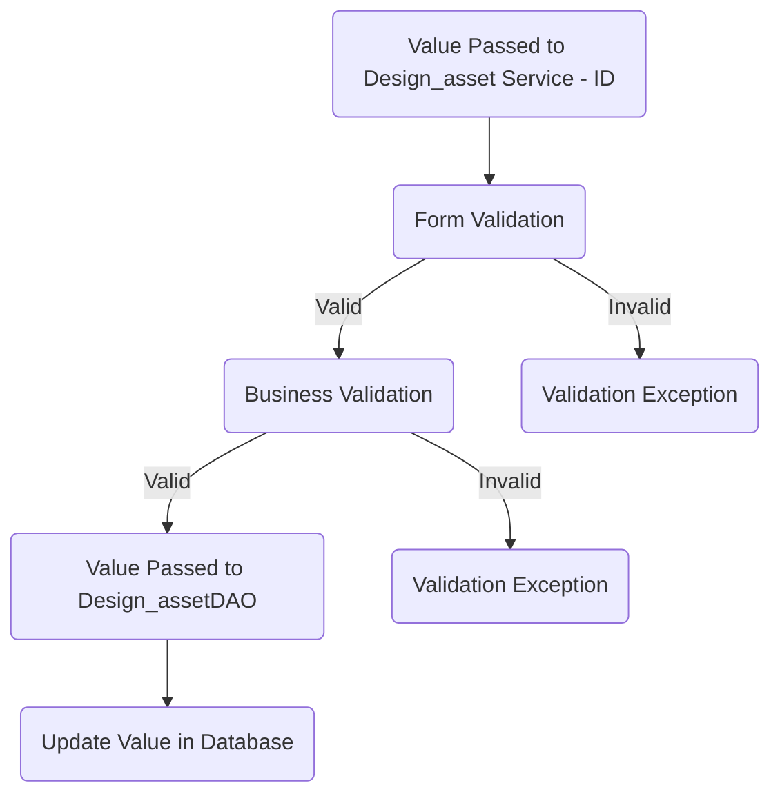
```mermaid
graph TD;
  A(Value Passed to Design_asset Service - ID ) --> B(Form Validation) -- Valid --> C(Business Validation)
  B --Invalid --> G(Validation Exception)
  C-- Valid --> D(Value Passed to Design_assetDAO)
  D --> E(Update Value in Database)
  C -- Invalid --> F(Validation Exception)
```

### Feature: Update Design details

> Designers can update an existing designs.

#### Pre-requisites:
- [ ]  designs model
- [ ]   designs DAO ( update )
- [ ]  designs service ( update )

#### Validations:

 - [ ]   Form Validation
   * design null
   * id can't be less than zero
   * name ( null, empty, pattern )
   * description ( null, empty )
   * location ( null, empty, pattern )
   * style Id ( <= 0 )
   * created by ( <= 0  ) 
   
  - [ ]   Business Validation
         * Check style id exists in style table
         * Check design id exists in designs table
         * Check created by exists in users table as designer

#### Messages:

   * Design object can not be null.
   * Id can't be less than zero.
   * Name can not be null or empty.
   * Name does not match the pattern.
   * Description can not be null or empty.
   * Location can not be null or empty.
   * Location does not match the pattern.
   * Style Id can't be less than zero.
   * Created By Id can't be less than zero.
   * Style Id doesn't exist.
   * Design Id doesn't exist.
   * Designers doesn't exist.
   
 #### Flow: 
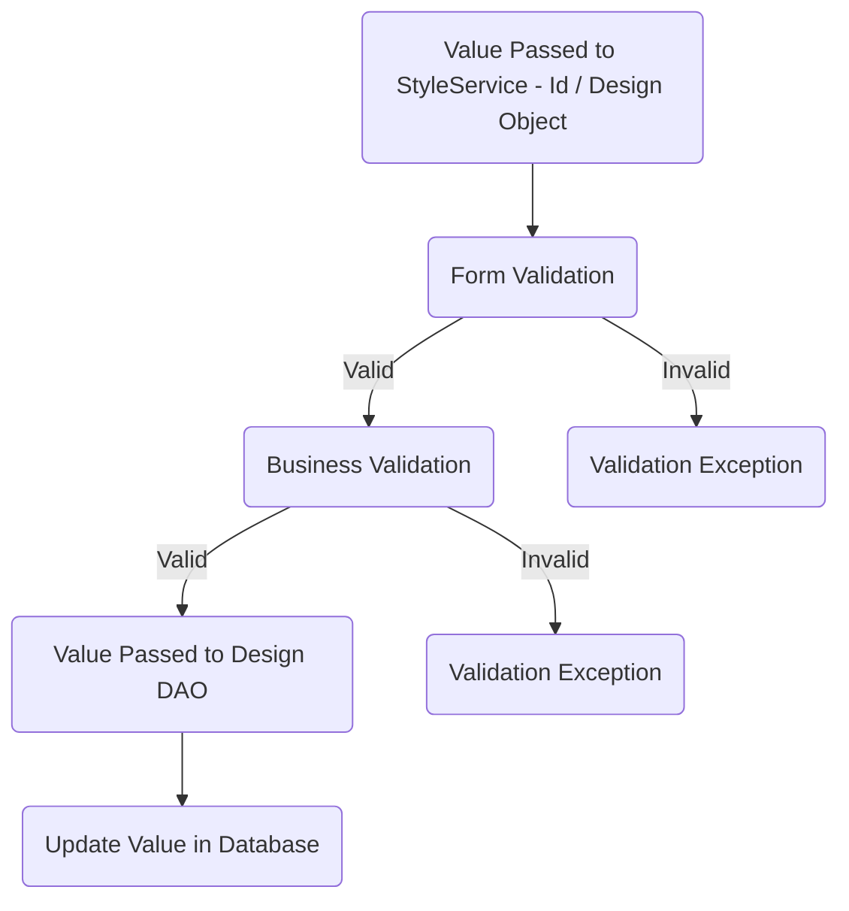
```mermaid
graph TD;
  A(Value Passed to StyleService - Id / Design Object) --> B(Form Validation) -- Valid --> C(Business Validation)
  B --Invalid --> G(Validation Exception)
  C-- Valid --> D(Value Passed to Design DAO)
  D --> E(Update Value in Database)
  C -- Invalid --> F(Validation Exception)
```

### Feature: Update Design Assets
> Designer can update their design and its assets.

#### Pre-requisites:
- [ ]  asset model
- [ ]  design asset DAO ( create )
- [ ]  design asset service ( create )
- [ ]  design asset DAO ( update )
- [ ]  design asset service ( update )

#### Validations:

 - [ ]   Form Validation
   * id ( <= 0 )
   * designs id ( <= 0 )
   * asset id ( <= 0 )
   
  - [ ]   Business Validation
         * Check id exist in design asset table 
         * Check design id exist in design table
         * Check asset id exist in asset table

#### Messages:

   *  id can't be less than zero
   * design id can't be less than zero
   * asset id can't be less than zero
   * Id doesn't exist in design asset table.
   * Design Id doesn't exist in design table
   * Asset Id doesn't exist in asset table
   
 #### Flow: 
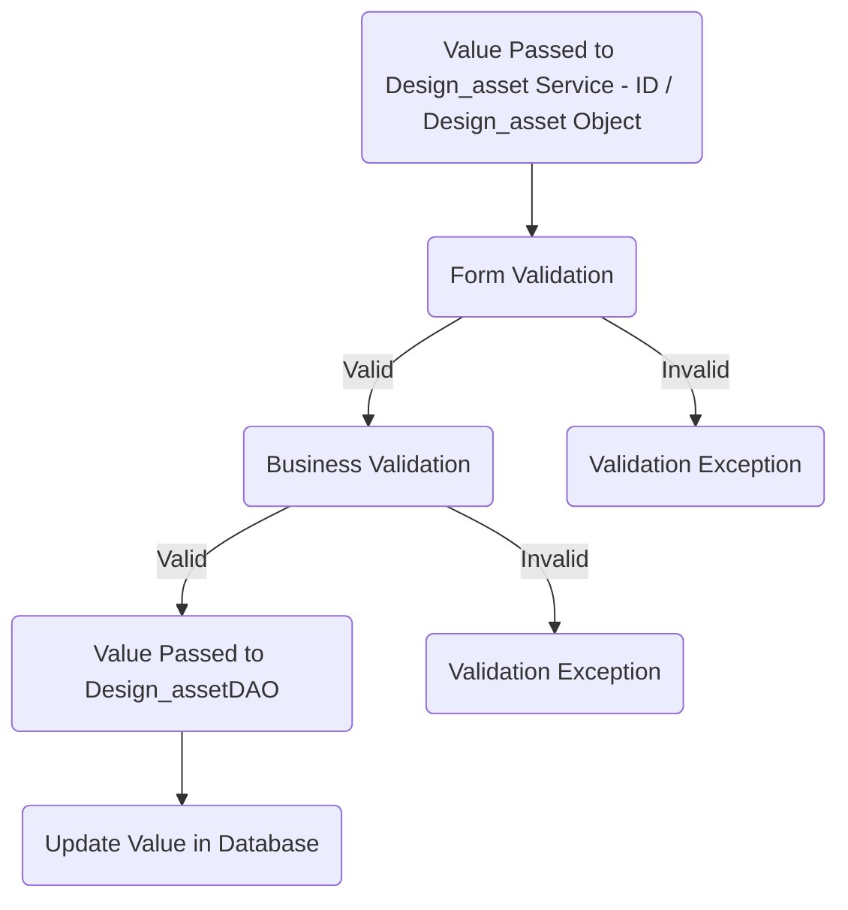
```mermaid
graph TD;
  A(Value Passed to Design_asset Service - ID / Design_asset Object) --> B(Form Validation) -- Valid --> C(Business Validation)
  B --Invalid --> G(Validation Exception)
  C-- Valid --> D(Value Passed to Design_assetDAO)
  D --> E(Update Value in Database)
  C -- Invalid --> F(Validation Exception)
```
### Feature: Delete Design  Assets
> Designer can delete their design and its assets.

#### Pre-requisites:
- [ ]  asset model
- [ ]  design_assets DAO ( delete )
- [ ]  design_assets service ( delete )

#### Validations:

 - [ ]   Form Validation
   * id ( <= 0 )
     
  - [ ]   Business Validation
         * Check id exist in design_assets table 

#### Messages:

   *  id can't be less than zero
   * Id doesn't exist in design table.
   
 #### Flow: 

```mermaid
graph TD;
  A(Value Passed to design_assets Service - ID ) --> B(Form Validation) -- Valid --> C(Business Validation)
  B --Invalid --> G(Validation Exception)
  C-- Valid --> D(Value Passed to design_assets DAO)
  D --> E(Update Value in Database)
  C -- Invalid --> F(Validation Exception)
```

